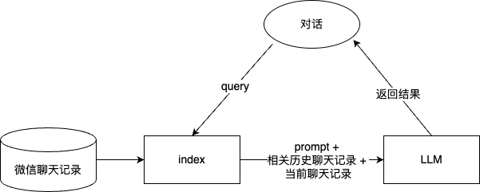

# WeChat-LLM: 根据微信聊天记录定制私人聊天机器人

## 项目简介
WeChat-LLM 是一个基于RAG的聊天机器人, 可以根据微信聊天记录定制模仿你的聊天风格的私人聊天机器人. 尝试使用LoRA对7b/13b的模型进行微调, 发现效果很差, 基于RAG的模型效果更好.

## TODO
- [x] 基础功能实现
- [ ] 根据token数量, 自动选择检索结果数量 (历史聊天记录长度)
- [ ] 根据token数量, 自动调整当前聊天记录上下文长度
## 项目实现
基于LlamaIndex实现, 使用Sentence Window Retrieval, 通过从历史聊天记录中检索相关的句子, 作为few-shot的输入, 通过prompt让模型学习语言风格, 从而实现模仿聊天风格的目的. 具体流程如下图所示: 



## 使用

### 准备

使用前, 请使用[WeChatMsg](https://github.com/LC044/WeChatMsg)提取微信聊天记录 (目前仅支持联系人记录, 不支持群聊, 如果多个联系人, 直接把导出的多个csv一起放在data/raw_data文件夹下). 目前提供了一个示例数据, 位于data/raw_data/chat.csv, 请参考该文件格式.

使用前请配置好OPENAI API.

```
export OPENAI_API_KEY="YOUR_API_KEY"
```

### 安装依赖

```
pip install -r requirements.txt
```

### 清洗数据

```
python scripts/clean_data.py
```

### 开始对话
```
python chat.py
```
